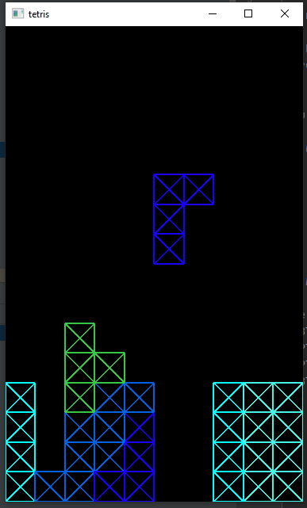

# rust-tetris
Tetris clone in Rust using the Amethyst Library



## Running

To run the game, run the following command, which defaults to the `vulkan` graphics backend:

```bash
cargo run
```

You can explicitly choose a graphics backend by adding `--no-default-features --features ["vulkan"/"metal"]`.

## Controls

`A` and `D` move the block left and right, respectively.

`W` rotates the block.

`S` and `Space` soft- and hard-drop the block, respectively.

## Progress

The game is in a basic playable state, complete with most defining features:
- Blocks spawn and fall
- Players can move the block left-right and rotate it
- Players can soft- or hard-drop the block
- Blocks in a line are destroyed, causing above lines to fall

TODO:
- Add sprite for single square, and tint it to draw blocks
- Add loss condition
- Add score and eventually high scores
- Speed up as game progresses, either with levels or passively
- Consider adding display of next one or several block types
- Add main and pause menus

## Contributing
Contributions are happily welcome! Even opening an issue regarding a bug your experienced or a feature you wished was included is helpful.

Anyone with experience in Amethyst graphics is welcome to take a crack at rendering sprite-based graphics for blocks. Adding `SpriteRender` to `DeadBlock` will be easy, but I'm still considering options for rendering the constituent squares on `Block`.

I am also open to any assets, graphical or otherwise, that anyone is willing to offer under a permissive license.

## License
The project is under the [MIT license](LICENSE.md). There are currently no assets, so no decision as to their licencing has been made.
